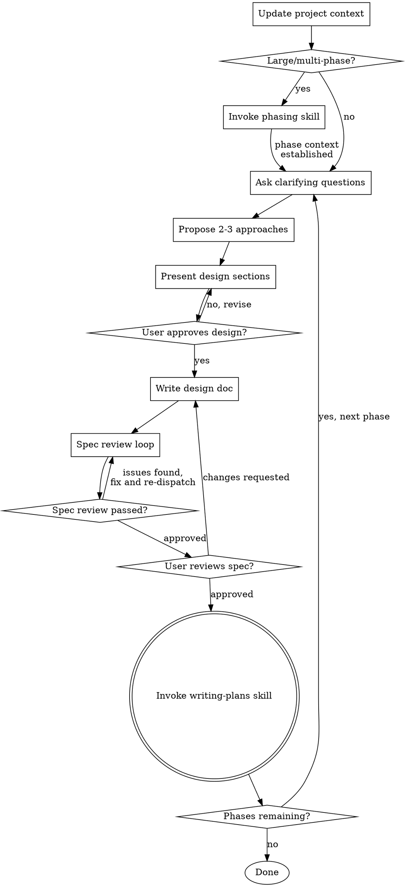

# Ruminate Ideas Into Designs

Help turn ideas into fully formed designs and specs through natural collaborative dialogue.

Start by updating project context, then ask questions one at a time to refine the idea. Once you understand what you're building, present the design and get user approval.

**If invoked with an established phase context** (i.e. the phasing skill has already run and passed Phase N as the working context), skip steps 1 and 2 — context and decomposition are already complete. Begin at step 3.

<HARD-GATE>
Do NOT invoke any implementation skill, write any code, scaffold any project, or take any implementation action until you have presented a design and the user has approved it. This applies to EVERY project regardless of perceived simplicity.
</HARD-GATE>

## Anti-Pattern: "This Is Too Simple To Need A Design"

Every project goes through this process. A todo list, a single-function utility, a config change — all of them. "Simple" projects are where unexamined assumptions cause the most wasted work. The design can be short (a few sentences for truly simple projects), but you MUST present it and get approval.

## Checklist

You MUST create a task for each of these items and complete them in order:

1. **Update project context** — check `docs/jeongri/context.md`, judge staleness by commit delta, update and commit if needed
2. **Assess scope** — single feature or large multi-phase project?
   - If large: invoke the phasing skill; it handles decomposition, review, and sign-off, then hands back here at step 3 with phase context established
   - If single: continue
3. **Ask clarifying questions** — one at a time, understand purpose/constraints/success criteria
4. **Propose 2-3 approaches** — with trade-offs, pattern conformance assessment, and your recommendation
5. **Present design** — in sections scaled to complexity, including pattern fit and testing; get user approval after each section
6. **Write design doc** — save to `docs/jeongri/specs/YYYY-MM-DD-<topic>-design.md` (include phase reference if applicable), commit
7. **Spec review loop** — dispatch spec-document-reviewer subagent with precisely crafted review context (never your session history); fix issues and re-dispatch until approved (max 3 iterations, then surface to human)
8. **User reviews written spec** — ask user to review the spec file before proceeding
9. **Transition** — invoke writing-plans skill; if phases remain, mark the current phase complete in the phases doc (add spec path), commit, then return to step 3 for the next pending phase

## Process Flow



**The terminal state is invoking writing-plans.** The only other skill ruminate invokes is the phasing skill (for large projects) and writing-plans (for implementation). Do not invoke any other skill.

## The Process

### 1. Project Context (`docs/jeongri/context.md`)

Before asking any questions, check for `docs/jeongri/context.md` and judge how much exploration is needed.

**Judging staleness by commit delta:**

```bash
# Extract stored SHA from context.md, then:
git rev-list <stored_sha>..HEAD --count
```

| Commit delta | Action |
|---|---|
| 0 | Trust context as-is, no update needed |
| 1–5 | Quick sanity check — skim recent commits, verify nothing structural changed |
| 6–20 | `git diff <stored_sha>..HEAD --stat` — identify changed areas, re-examine only those |
| 21+ or no SHA | Full re-exploration — rebuild context from scratch |

**Context document format:**

```markdown
# Project Context

Last verified: YYYY-MM-DD
Last verified SHA: <full sha>

## Test Framework & Patterns
<framework name, where tests live, how they are structured, what a new test should model itself after>

## Architecture & Conventions
<folder structure, component organisation, key architectural patterns>

## Naming Conventions
<file naming, class/function/variable naming patterns>

## Key Dependencies
<libraries and frameworks in active use>
```

After writing or updating, commit with: `docs: update project context (YYYY-MM-DD)`

### 2. Scope Assessment

Before asking detailed questions, assess scope. If the request describes multiple independent subsystems, flag this immediately. Don't spend questions refining details of a project that needs decomposing first.

**If single-scoped:** proceed to clarifying questions.

**If large/multi-phase:** invoke the phasing skill. It handles decomposition, phase review, and user sign-off, then hands back here with phase context established. See `skills/phasing/SKILL.md`.

### 3. Clarifying Questions


**Clarifying questions:**
- Ask one question at a time
- Prefer multiple choice when possible, but open-ended is fine too
- Focus on: purpose, constraints, success criteria
- If a topic needs more exploration, break it into multiple questions across messages

### 4. Approaching the Problem

- Propose 2–3 different approaches with trade-offs
- Present options conversationally with your recommendation and reasoning
- Lead with your recommended option and explain why
- For each approach, explicitly assess **pattern conformance**: does it follow existing patterns found in `context.md`, or introduce something new? If new, briefly justify why existing patterns don't fit

### 5. Presenting the Design

Once you understand what you're building, present the design in sections scaled to their complexity. Ask after each section whether it looks right. Cover:

**Architecture** — components, boundaries, data flow

**Pattern fit** — for each significant decision, state whether it follows an existing pattern or introduces something new:
> "This follows the existing X pattern used in Y."
> "This introduces Z — existing patterns don't cover async queuing, so we're establishing a new convention here."

**Error handling**

**Testing** — always a dedicated section. Based on patterns from `context.md`:
- Propose specific test cases by type (unit, integration, e2e) as appropriate
- Reference existing test files as models where relevant
- Note any new test infrastructure needed

**Design for isolation and clarity:**
- Break the system into smaller units that each have one clear purpose, communicate through well-defined interfaces, and can be understood and tested independently
- For each unit, you should be able to answer: what does it do, how do you use it, what does it depend on?
- Can someone understand what a unit does without reading its internals? Can you change the internals without breaking consumers? If not, the boundaries need work.

**Working in existing codebases:**
- Follow existing patterns found in `context.md`. Where existing code has problems that affect the work, include targeted improvements as part of the design.
- Don't propose unrelated refactoring. Stay focused on what serves the current goal.

### 6. Writing the Spec

Save to `docs/jeongri/specs/YYYY-MM-DD-<topic>-design.md`.

**If this spec covers a phase**, include at the top of the document:

```markdown
**Phase:** N of M — <Phase Name>
**Phases document:** `docs/jeongri/phases/YYYY-MM-DD-<topic>.md`
```

- Use elements-of-style:writing-clearly-and-concisely skill if available
- Commit the spec with: `docs: add spec for <topic>`

## After the Design

**Spec Review Loop:**

1. Dispatch spec-document-reviewer subagent (see spec-reviewer.md)
2. If issues found: fix, re-dispatch, repeat until approved
3. If loop exceeds 3 iterations, surface to human for guidance

**User Review Gate:**

After the spec review loop passes:

> "Spec written and committed to `<path>`. Please review it and let me know if you want any changes before we start on the implementation plan."

Wait for the user's response. If they request changes, make them and re-run the spec review loop. Only proceed once the user approves.

**Implementation:**

Invoke the writing-plans skill to create a detailed implementation plan. Do NOT invoke any other skill — writing-plans is the next step.

If there are remaining phases, return to step 4 (clarifying questions) for the next pending phase after the plan is created.

## Key Principles

- **One question at a time** — don't overwhelm with multiple questions
- **Multiple choice preferred** — easier to answer than open-ended when possible
- **YAGNI ruthlessly** — remove unnecessary features from all designs
- **Explore alternatives** — always propose 2–3 approaches before settling
- **Incremental validation** — present design, get approval before moving on
- **Pattern conformance** — new designs should fit what already exists; justify any deviation
- **Testing is not optional** — every design includes proposed test cases
- **Be flexible** — go back and clarify when something doesn't make sense
